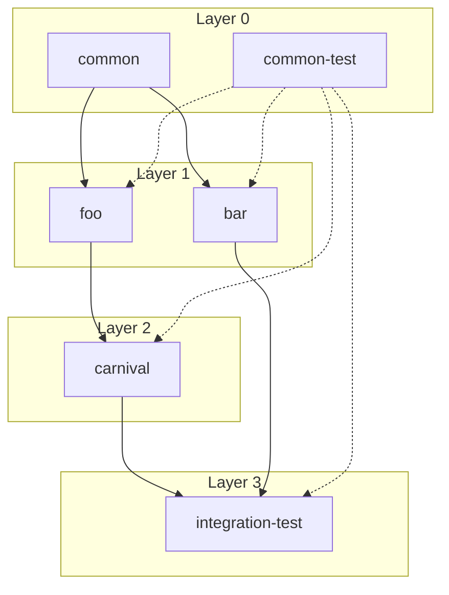

# Maven Module Dependencies

Solid arrows are compile-scope dependencies. Dashed arrows are test-scope dependencies.

```mermaid
graph TD
    subgraph L0["Layer 0"]
        common
        common-test
    end
    subgraph L1["Layer 1"]
        foo
        bar
    end
    subgraph L2["Layer 2"]
        carnival
    end
    subgraph L3["Layer 3"]
        integration-test
    end

    common --> foo
    common --> bar
    foo --> carnival
    carnival --> integration-test
    bar --> integration-test

    common-test -.-> foo
    common-test -.-> bar
    common-test -.-> carnival
    common-test -.-> integration-test
```
